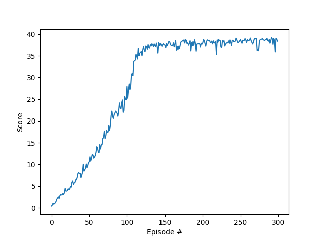

## Deep Reinforcement Learning - DDPG, TD3 and A2C applied to Reacher game


This repository holds the project code for using Deep Reinforcement Learning algorithms - DDPG, TD3 and A2C on Reacher envrionment with continuous controls provided by Unity Technology. It is part of the Udacity [Deep Reinforcement Learning Nanodegree](https://www.udacity.com/course/deep-reinforcement-learning-nanodegree--nd893) requirement. 

The state is represented as a 33 dimensional observations including the agent's velocity, ray-based perception of objects etc.. The agent has to learn to choose the optimal action based on the state it finds itself in. The action space is a 4 dimensional continuous space representing the torque of the double jointed robot arms. The agent's goal is to track a moving object as many time steps as possible. A reward of +0.1 is earned each step the agent successfully tracks the moving object. The environment is considered solved when the return reaches an average of 30 consistently (over 100 episodes). 

All three algorithms solved the environment and A2C seems to be the best.   


## Installation
1. Install the Dependencies and setup python environment
Please follow the instructions in the [DRLND GitHub repository](https://github.com/udacity/deep-reinforcement-learning) to set up your Python environment.
2. There are two versions of the environment. First is the single agent version and the second is the multi-agent version. Download the Unity Environment (specifically built for this project, **not** the Unity ML-Agents package). Then place the file in the root folder and unzip the file.
For the first verion:
    * Linux: [click here](https://s3-us-west-1.amazonaws.com/udacity-drlnd/P2/Reacher/one_agent/Reacher_Linux.zip)
    * Mac: [click here](https://s3-us-west-1.amazonaws.com/udacity-drlnd/P2/Reacher/one_agent/Reacher.app.zip)
    * Windows (32-bit): [click here](https://s3-us-west-1.amazonaws.com/udacity-drlnd/P2/Reacher/one_agent/Reacher_Windows_x86.zip)
    * Windows (64-bit): [click here](https://s3-us-west-1.amazonaws.com/udacity-drlnd/P2/Reacher/one_agent/Reacher_Windows_x86_64.zip)    
For the second version:    
    * Linux: [click here](https://s3-us-west-1.amazonaws.com/udacity-drlnd/P2/Reacher/Reacher_Linux.zip)    
    * Mac: [click here](https://s3-us-west-1.amazonaws.com/udacity-drlnd/P2/Reacher/Reacher.app.zip)    
    * Windows (32-bit): [click here](https://s3-us-west-1.amazonaws.com/udacity-drlnd/P2/Reacher/Reacher_Windows_x86.zip)    
    * Windows (64-bit): [click here](https://s3-us-west-1.amazonaws.com/udacity-drlnd/P2/Reacher/Reacher_Windows_x86_64.zip)

3. Import the environment in Jupyter notebook under the the *drlnd* environment.
```
from unityagents import UnityEnvironment
env = UnityEnvironment(file_name="[to be replaced with file below depending on OS]")
```
Replace the file name with the following depending on OS:  
  * Mac: "Reacher.app"
  * Windows (x86): "Reacher_Windows_x86/Reacher.exe"
  * Windows (x86_64): "Reacher_Windows_x86_64/Reacher.exe"
  * Linux (x86): "Reacher_Linux/Reacher.x86"
  * Linux (x86_64): "Reacher_Linux/Reacher.x86_64"
  * Linux (x86, headless): "Reacher_Linux_NoVis/Reacher.x86"
  * Linux (x86_64, headless): "Reacher_Linux_NoVis/Reacher.x86_64"
## How to Run
Load the Jupyter notebook *Report.ipynb* and run all cells.
